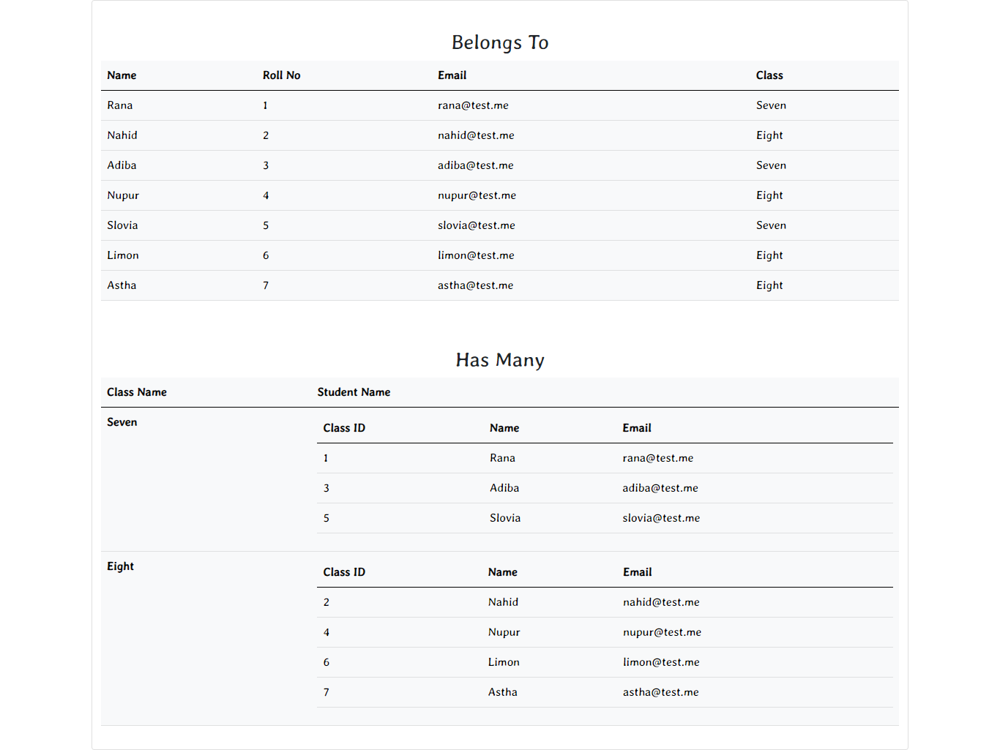

# Eloquent-Relationships
Has Many and Belongs To System are Included

<h6>Tested HasMany, Belongs To and Many to Many Functionality of Laravel Project</h6>
Has One and Belongs To  

 
Many to Many (BelongsToMany)

 
Thanks,  
Rana Bepari  
<a href="https://ranasvc.com">Official Website</a>
